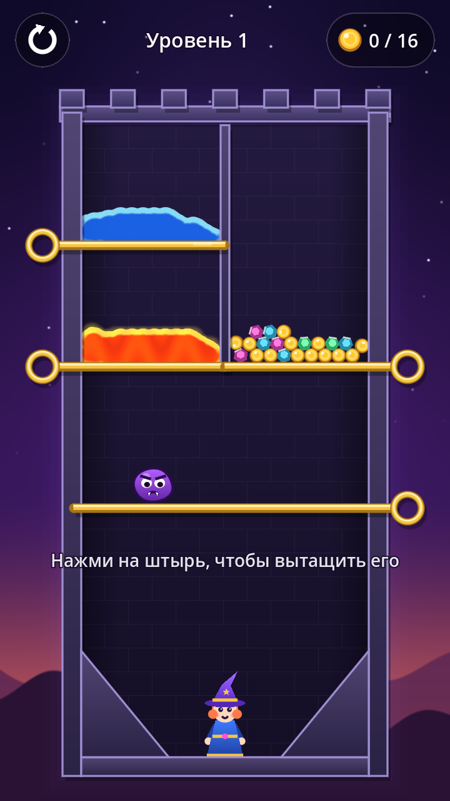
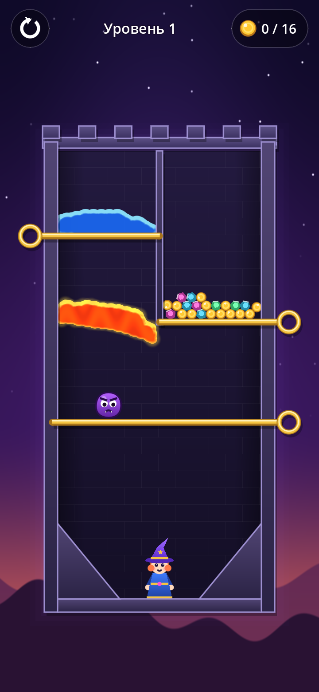
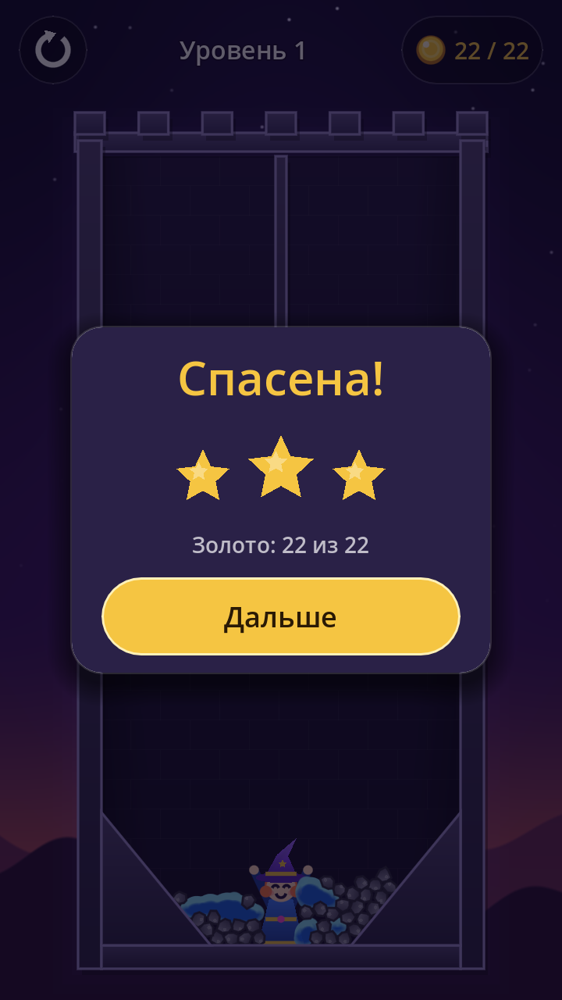

# Алхимическая башня

Мобильная головоломка для Android в жанре «вытащи штырь» (как Hero Rescue), но со своей фишкой:
вместо пары «лава/вода» в башне алхимика живут зелья, которые **реагируют друг с другом**.
Спаси ученицу алхимика: вытаскивай штыри в правильном порядке, чтобы зелья обезвредили врагов,
а золото докатилось до героини.

| Старт | Лава в деле | Победа |
|---|---|---|
|  |  |  |

Идея и план развития: [docs/CONCEPT.md](docs/CONCEPT.md). Формат уровней: [docs/LEVEL_FORMAT.md](docs/LEVEL_FORMAT.md).

## Что уже есть

- Движок **Godot 4.5+** (GDScript), портретный экран 720×1280, растягивается на любые телефоны
  (в том числе 19.5:9 с вырезом камеры).
- Играбельный демо-уровень: лава, вода, золото, слизень, четыре штыря.
- Реакции: вода + лава → камень (застывание волной по всей луже), кислота растворяет камень,
  вода разбавляет кислоту. Лава и кислота убивают врагов и героиню.
- «Живые» жидкости: капли сливаются в единую массу с бликами и свечением лавы (metaballs-шейдер).
- Интерфейс: перезапуск, счётчик золота, подсказка, экран победы со звёздами, экран поражения.
- Сохранение прогресса (`user://progress.cfg`).
- Уровни — обычные JSON-файлы, новый уровень не требует кода.

## Производительность

Сделано с расчётом на слабые Android-телефоны:

- рендер **Compatibility (OpenGL ES 3)** — работает на самом широком круге устройств и быстро стартует;
- все капли жидкости рисуются **одним draw call** (MultiMesh) в буфер половинного разрешения,
  затем один проход шейдера — стоимость почти не зависит от числа капель;
- никаких текстур и шрифтов в сборке: графика рисуется векторно, APK держится маленьким
  (основной вес — сам движок);
- контакты физики включены только у «активных» веществ (вода, кислота, враги), реакции
  обрабатываются пачкой в `_physics_process`, а не в колбэках;
- эффекты (пар, искры, брызги) — одна лёгкая система частиц на уровень без создания узлов;
- камера подгоняет уровень под экран, физический мир всегда в одних координатах.

## Как открыть проект

1. Скачай [Godot 4.5 или новее](https://godotengine.org/download) (обычная версия, не .NET).
2. Склонируй репозиторий: `git clone https://github.com/crownfall90-dot/mobile-game`
   (или Code → Download ZIP на GitHub).
3. В Godot: **Import** → выбери `project.godot` → **Import & Edit**.
4. **F5** — запуск. На компьютере тапы эмулируются мышью.

## Сборка APK для Android

Один раз:

1. В Godot: **Editor → Manage Export Templates → Download and Install**.
2. Установи [Android Studio](https://developer.android.com/studio) (или только command-line tools)
   и через SDK Manager поставь *Android SDK Platform-Tools* и *Build-Tools*.
3. **Editor → Editor Settings → Export → Android**: укажи `Android SDK Path`
   (обычно `~/Android/Sdk` или `%LOCALAPPDATA%\Android\Sdk`) и `Java SDK Path` (JDK 17+).
   Отладочный ключ Godot создаст сам.

Сборка:

- **Project → Export → Android → Export Project**, сними галочку *Export With Debug* для релизной
  сборки. Файл появится в `build/alchemy-tower.apk`.
- Или из консоли: `godot --headless --export-release "Android" build/alchemy-tower.apk`.

Для релиза в Google Play нужен свой ключ подписи (keystore): создай его
(`keytool -genkeypair -keystore release.keystore -alias alchemy -keyalg RSA -keysize 2048 -validity 10000`)
и укажи в пресете экспорта в разделе *Keystore → Release*. **Никогда не коммить keystore в git.**
Для Google Play включи *Gradle Build* и формат **AAB**.

Установка на телефон: скопируй APK на телефон, открой его и разреши установку из этого источника.

## Структура проекта

```
project.godot           настройки: портрет 720×1280, рендер Compatibility, гравитация
export_presets.cfg      пресет экспорта Android (arm64 + armv7)
scenes/main.tscn        корневая сцена
scripts/game.gd         автозагрузка Game: список уровней, прогресс
scripts/main.gd         фон, камера, загрузка уровней, экран результата, dev-флаги
scripts/level/          игровая логика
  level.gd              сборка уровня из JSON, реакции, победа/поражение
  substances.gd         каталог веществ и слои физики
  item.gd               капля / монета / кристалл / камень
  pin.gd                штырь и его анимация
  enemy.gd, hero.gd     слизень и ученица (рисуются кодом)
  fluid_renderer.gd     metaballs-жидкости
  walls.gd, backdrop.gd стены и задник башни
  fx.gd                 лёгкие эффекты частиц
scripts/ui/hud.gd       интерфейс
shaders/                фон и жидкости
levels/                 index.json + уровни
tools/test_levels.sh    автопрохождение всех уровней без окна
```

## Проверка уровней

Каждый уровень хранит правильный порядок штырей в поле `solution`. Скрипт проходит все уровни
без окна и падает, если какой-то не проходится:

```
GODOT=/путь/к/godot tools/test_levels.sh
```

Полезные флаги запуска (после `--`): `--level=N`, `--autoplay`, `--pins=lava,water`,
`--shot=/tmp/shot.png@2.5` (скриншот через 2.5 с).
