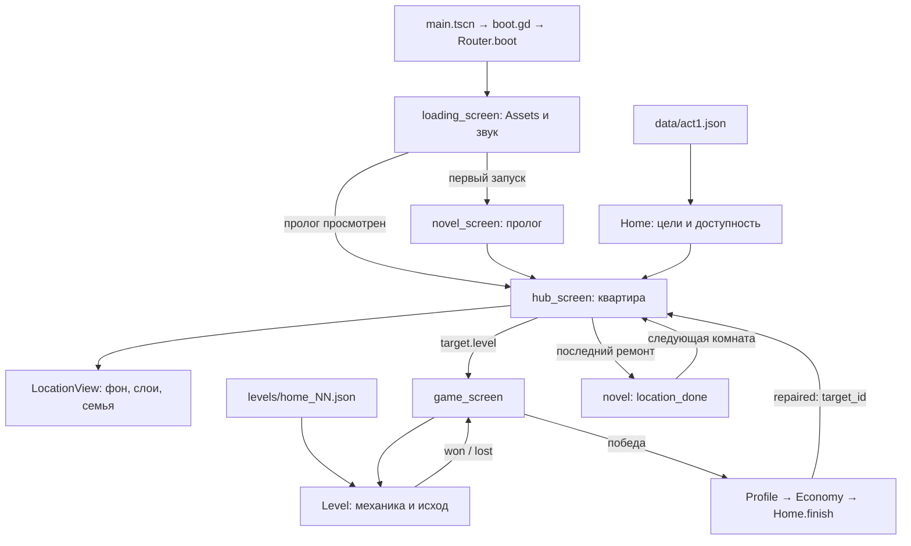

# Vita — карта действующей игры

Сверено с исходниками 26.09.2026, ветка `claude/project-thread-x4ht8m`.
Это навигатор по существующему проекту, а не план новой реализации.
Godot 4.5.1, GDScript, GL Compatibility, Android, вертикальный экран.
Текущий объём: **акт 1, четыре локации, 19 ремонтов**. Акт 2 сейчас не разрабатывать.

## Начать здесь

- **Найти место изменения:** таблица «Что менять» ниже.
- **Точное состояние работ:** [HANDOFF.md](HANDOFF.md), последние записи; сначала `git status --short`.
- **Общение с Opus:** [COORDINATION.md](COORDINATION.md), [issue #3](https://github.com/crownfall90-dot/mobile-game/issues/3).
- **Графика:** [ART_BRIEF.md](ART_BRIEF.md) — требования, [ART_STATUS.md](ART_STATUS.md) — поставки и ограничения.
- **Источник структуры акта:** [data/act1.json](../data/act1.json). Сценарий: [data/novel.json](../data/novel.json).
- [DESIGN.md](DESIGN.md) — архив прежней игры. Старые записи про 10 ремонтов и будущие акты не являются текущим заданием. [FAMILY_HOME.md](FAMILY_HOME.md) сохраняет историю концепции.

При расхождении карты с кодом проверить исходник и обновить карту в том же коммите.
Наличие файла, картинки, APK или записи PASS не означает, что весь продукт принят владельцем.

## Что менять

| Задача / симптом | Начать с | Связанные места |
|---|---|---|
| Мебель висит, перекрывает вещи, неверный масштаб | `data/act1.json`: `rect`, `z`, `family`, `props`, `decor` | `LocationView._fit`, `_layers`, `_update_family`; PNG в `art/act1/` |
| Предмет спрятан за кнопками, экран растягивается | `hub_screen.gd`: `_layout`, `_safe_top`, `_safe_bottom` | `act1.json.scene`, `LocationView._extend`; регрессия `tools/test_home.gd` |
| Нажатие выбирает не ту вещь | `hub_screen.gd._gui_input` → `LocationView.target_at` | Обратное преобразование `_offset`/`_k`, `rect`, `more`, `z` |
| Не открывается комната / ремонт начисляется дважды | `Home.finish`, `is_unlocked`, `location_done` | `GameScreen._on_won`, `Profile`, `test_home.gd` |
| Изменить конкретную головоломку | `levels/home_NN.json`, таблица 19 уровней ниже | `Level.build`, файл механики, `tools/verify.py` |
| Победа / поражение / звёзды | `level.gd`: `_update_outcome`, `_win`, `_lose`, `star_rule` | Сигналы механик, `GameScreen._on_won/_on_lost` |
| Награда / цена / эффект покупки | `Economy.reward_lines`, `Home.SHOP`, `Home.buy` | `Profile.record_result`, `Level._brave`, `LocationView._with_teddy` |
| Реплики / порядок сцен / пропуск | `data/novel.json`, `novel_screen.gd` | Реплики хаба — `act1.json.lines`, `targets.cheer` |
| Альбом / фото / новоселье | `album_popup.gd`, `photo_card.gd` | `Home.location_done`, флаги `Profile`, `novel.json` |
| Потеря прогресса / сброс | `scripts/core/profile.gd` | `settings_popup.gd`, `Home.migrate`, `test_home.gd` |
| Старт / загрузка / назад | `Router.boot`, `loading_screen.gd`, `Assets` | `project.godot`, `boot.gd`, `DevRunner` |
| Кнопки / итог / подсказка / обучение | `scripts/ui/kit.gd`, `hud.gd`, `howto_popup.gd` | `game_screen.gd`, `scripts/popups/` |
| Звук / музыка / дождь | `scripts/audio/sfx.gd`, `music.gd`, `ambience.gd` | `LocationView.ambience`, настройки `Profile` |
| Отчёты о сбоях | `scripts/core/reports.gd`, `data/telemetry.json` | Выключены без DSN; Android либо явный тестовый режим |
| Сборка / версия / состав APK | `project.godot`, `export_presets.cfg` | Инструкция в `HANDOFF.md`, прежний ключ подписи вне Git |

Пути в таблицах — от корня репозитория; короткие имена скриптов раскрыты в разделах модулей.

## Путь игрока и поток данных



1. `project.godot` запускает [main.tscn](../scenes/main.tscn). Экраны и комнаты создаются скриптами; отдельной `.tscn` для каждой комнаты нет.
2. `Router.boot()` выбирает загрузку либо `DevRunner`, если переданы флаги после `--`.
3. Хаб открывает последнюю доступную комнату. Внутри неё игрок выбирает любую сломанную вещь; последовательно открываются комнаты, а не обязательно вещи.
4. Касание переводится из экранных координат в координаты сцены. `LocationView.target_at()` возвращает предмет; `target.level` выбирает JSON головоломки.
5. `GameScreen.restart()` читает данные через `Game`, создаёт `Level`, подключает HUD и сигналы. `Level` ведёт механику; экран — переходы и запись результата.
6. Победа: `Profile.record_result()` вычисляет новые звёзды → `Economy.level_reward()` начисляет награду → `Home.finish()` ставит `home.<target_id>` и сразу сохраняет. Повтор не чинит предмет снова; награда возможна за новые звёзды.
7. Хаб с аргументом `repaired` временно показывает старый вид, затем `LocationView.play_repair()` анимирует замену. Это отображение уже сохранённого ремонта, не момент начисления.
8. `_celebrate()` после последнего ремонта комнаты открывает `<location>_done`. После гостиной сценарий включает `act1_end`, затем игра остаётся в первом акте.

## Модули

### Автозагрузки — порядок из project.godot

| Имя | Файл | Ответственность |
|---|---|---|
| Reports | `scripts/core/reports.gd` | Сбор и опциональная отправка ошибок |
| Loc | `scripts/core/loc.gd` | RU/EN из `data/strings/*.json`, `t`, `pick` |
| Profile | `scripts/core/profile.gd` | Состояние, запись, восстановление, настройки |
| Assets | `scripts/core/assets.gd` | Очередь подгрузки, прогресс, ограниченный кэш |
| Game | `scripts/core/game.gd` | `levels/index.json`, загрузка JSON, dev-флаги |
| Economy | `scripts/core/economy.gd` | Награды и подсказки; изменяет Profile |
| Sfx | `scripts/audio/sfx.gd` | Звуки, музыка, атмосфера, вибрация |
| Monetization | `scripts/core/monetization.gd` | Заглушки рекламы и покупок |
| Router | `scripts/core/router.gd` | Стек экранов, попапы, затемнение, назад, сворачивание |

`Home` — **статический класс**, не автозагрузка: `scripts/core/home.gd`.
Он кэширует `act1.json`, связывает предметы с уровнями, управляет доступностью комнат
и каталогом четырёх покупок. После изменения JSON нужен новый запуск для сброса кэша.

### Экраны и окна

Реестр `Router.SCREENS`: только `loading`, `hub`, `game`, `novel`.
Файлы `scripts/screens/<имя>_screen.gd`. Контракт — `open(args)`;
дополнительно `on_back`, `on_app_pause`, `on_resume`.
`Router.go()` заменяет стек, `push()` снимает предыдущий экран с дерева,
`back()` возвращает его. Системная «назад» сначала обрабатывает попап, затем экран.

Попапы `shop`, `pause`, `settings`, `album`, `howto`, `confirm` лежат в `scripts/popups/`.
Основа — `UiPopup` (`scripts/ui/popup.gd`), результат — сигнал `closed(result)`.
Итог победы/поражения создаёт **Hud** (`scripts/ui/hud.gd`), отдельного зарегистрированного result-попапа нет.

### Головоломки

- `scripts/level/level.gd` — сборка мира, ввод, контакты и реакции, цели, исход, звёзды, API автопрохождения.
- `pin.gd`, `walls.gd`, `item.gd`, `substances.gd`, `fluid_renderer.gd` в той же папке — засовы, препятствия, вещества, жидкость.
- `dirt.gd`, `dig_hint.gd` — раскопки; `putty.gd` — рисование твёрдых линий; `pipe_switch.gd` — переключение труб.
- `leak.gd`, `dishes.gd`, `plunger.gd`, `mirrors.gd`, `sew.gd` — специальные механики.
- `receiver.gd` — приёмник внутри вещи; `family_hero.gd`, `hero.gd`, `enemy.gd`, `exit_door.gd` — участники поддерживаемых вариантов уровней.
- `home_backdrop.gd`, `level_skin.gd`, `item_art.gd`, `fx.gd` — оформление и эффекты.

Мир уровня — **720×1280**. Экран адаптируется камерой, без изменения масштаба физических тел.
[LEVEL_FORMAT.md](LEVEL_FORMAT.md) описывает базовый формат; новые поля сверять с
`Level.build()`, действующими JSON и `tools/lint_levels.py`: документ не исчерпывает новые механики.

## Все 19 связок «вещь → головоломка»

Файл каждой строки — `levels/<уровень>.json`. Механики указаны по текущему коду.

| Локация | ID предмета | Уровень | Основная механика / код |
|---|---|---|---|
| Комната | `room_window` — окно | `home_01` | Желоб: `putty.gd` |
| Комната | `room_bed` — кровать | `home_02` | Раскопки: `dirt.gd` |
| Комната | `room_floor` — дыра | `home_03` | Раскопки, вода и камни: `dirt.gd`, `level.gd` |
| Комната | `room_wall` — стена | `home_04` | Трубы: `pipe_switch.gd` |
| Кухня | `kitchen_sink` — раковина | `home_05` | Порядок засовов и потоков: `pin.gd`, `level.gd` |
| Кухня | `kitchen_stove` — плита | `home_06` | Раскопки и потоки: `dirt.gd`, `level.gd` |
| Кухня | `kitchen_fridge` — холодильник | `home_07` | Поворот мира: `Level.rotate_world` |
| Кухня | `kitchen_cabinets` — шкафы | `home_08` | Стопка посуды: `dishes.gd` |
| Кухня | `kitchen_ceiling` — потолок | `home_09` | Капли и течи: `leak.gd` |
| Санузел | `bath_tub` — ванна | `home_10` | Наклон мира: `Level.rotate_world` |
| Санузел | `bath_toilet` — туалет | `home_11` | Засов и трубы: `pin.gd`, `pipe_switch.gd` |
| Санузел | `bath_sink` — раковина | `home_12` | Вантуз по ритму: `plunger.gd` |
| Санузел | `bath_tiles` — плитка | `home_13` | Опоры/желоб: `putty.gd` |
| Санузел | `bath_light` — светильник | `home_14` | Направить свет: `mirrors.gd` |
| Гостиная | `living_sofa` — диван | `home_15` | Шитьё: `sew.gd` |
| Гостиная | `living_tv` — телевизор | `home_16` | Настройка на основе `mirrors.gd` |
| Гостиная | `living_lamp` — люстра | `home_17` | Направить свет: `mirrors.gd` |
| Гостиная | `living_wall` — стена | `home_18` | Трубы: `pipe_switch.gd` |
| Гостиная | `living_floor` — пол | `home_19` | Раскопки, вода и камни: `dirt.gd`, `level.gd` |

`--home-stage=0/4/9/14/19` — число ремонтов: начало комнаты/кухни/санузла/гостиной/всё готово.
`levels/solutions/` — результаты перебора проверок; исходное решение и сценарии действий
находятся также в JSON уровня (`solution`, сценарии). `levels/legacy/` — архив.

## Сборка интерьера

Хаб — **720×1560**, отдельно от 720×1280 головоломки. `scene.size` и `scene.safe`
лежат в `act1.json`. `rect = [x, y, width, height]`, x вправо, y вниз.

| Данные | Значение |
|---|---|
| `locations[].id` | `room`, `kitchen`, `bath`, `living`; определяет папку фона/целей |
| `targets[]` | Ремонтируемые вещи: уникальные `id`, `level`, `rect`, `z`, подписи, реплики |
| `targets[].more` | Дополнительные области одного ремонта, например несколько дыр |
| `targets[].overlay` | Исчезающее повреждение; fixed-слой для такого оверлея может отсутствовать |
| `props[]` | Отдельные PNG: `img` от `art/act1/` без `.png`, `rect`, `z`, опционально `flip` |
| `family` | Общая пара: `pos` — центр нижнего края изображения, `height` — высота |
| `decor` | Размещение покупок в поддерживаемых комнатах |
| `gloom`, `lines`, `teddy` | Хмурь, реплики, резервное размещение мишки |

`LocationView.setup()` читает `art/act1/<location>/background.png` и
`<target_id>_broken.png` / `<target_id>_fixed.png`. `Assets` лишь подгружает ресурсы;
рисунком управляет `scripts/art/location_view.gd`.

Порядок: фон с шейдером износа → цели/props с `z < 2` → общая пара →
слои с `z >= 2` и эффекты переднего плана. При равном z цель раньше prop.
Это ручные слои, **не автоматическая сортировка по глубине**. Отдельные позы семьи
в кухне, санузле и гостиной — тоже `props`.

Текстура равномерно вписывается в rect и центрируется. Прозрачные поля означают,
что низ rect не обязательно совпадает с ножкой мебели или подошвой.
Сначала определить стык пола и стены, реальные опорные точки, масштаб относительно
людей, функциональные группы и проходы. Затем менять координаты и смотреть целую
сцену до/после ремонта, с покупками и без них. Проверка доступности центра предмета
не доказывает, что мебель стоит на полу.

Хаб использует один масштаб и смещение; ввод — обратное преобразование.
Кнопки сверху, переходы снизу и вырез устройства учитывать отдельно.
Краевые поля не должны растягивать сам интерьер.

## Сюжет и сохранение

- `data/novel.json`: `names`, `scenes`, `album`; шаги `bg`, `say/text`, `show`, `choice`, `cg`, `scene`. Контракт — начало `novel_screen.gd`.
- `LocationView` переиспользуется для комнатных фонов новеллы; `state: broken|fixed` задаёт историческое состояние для повтора из альбома.
- Флаги: `home.<target_id>` — ремонт; `home.v2` — миграция десяти старых ремонтов; `seen.<location>` — приветствие; `seen.prologue`, `seen.novel.<scene>` — сюжет; `tut.<kind>` — обучение.
- Четыре части фото зависят от завершения комнат; `scripts/ui/photo_card.gd` собирает изображение. `album_popup.gd.goals()` считает цели; новоселье доступно после **57 звёзд и четырёх покупок**.
- Покупки `vita_plant`, `vita_teddy`, `vita_clothes`, `vita_picture`: состояние в Profile, каталог в Home, награды в Economy, визуал в LocationView.
- Сохранение v2: `user://save.json`, временный `save.tmp`, резервный `save.bak`; проверка записанного файла и восстановление при повреждении. `save()` откладывает запись, `flush()` пишет сразу. Сброс обновляет также резервную копию.
- Dev-флаги включают `Profile.volatile`: обычное сохранение не меняется. Проверка записи использует отдельный тестовый путь.

## Проверки по изменённому поведению

Команды из корня проекта; `godot` означает Godot 4.5.1.
На текущем Windows движок находится в `D:/tools/godot/Godot_v4.5.1-stable_win64_console.exe`.

```powershell
# Связи ремонтов, покупки, сохранение/сброс, адаптация хаба
 godot --headless --path . -- --home-selfcheck
# Экраны/попапы, победа и поражение, возвраты
 godot --headless --path . -- --smoke
# Изменённый уровень: G1–G4; без --quick — полный прогон
 python tools/verify.py home_05 --quick --godot "D:/tools/godot/Godot_v4.5.1-stable_win64_console.exe"
# Снимок готовой кухни; для сломанной заменить 19 на 4
 godot --path . --rendering-driver opengl3 --resolution 450x1000 -- --screen=hub --home-stage=19 --screen-args=location:kitchen --profile-flags=seen.kitchen --home-items=vita_teddy,vita_plant,vita_picture --shot=build/kitchen-review.png@3.0
```

Для снимка создать `build/`, если папки нет. Проверять нужные сцены на 450×800
и 450×1000. `--shot` требует графического режима. Флаги — в `scripts/dev/dev_runner.gd`.
Самопроверка — `tools/test_home.gd`; G1–G7 и исключения специальных механик — начало
`tools/verify.py`. Проверки могут обновить `levels/solutions/`: смотреть diff отдельно.

Экспорт APK и headless-проверки **не заменяют физический Android**.
Подпись обновления — прежним ключом: локальную debug-сборку нельзя считать совместимой
с ранее выданным облачным APK.

## Ограничения и поддержка карты

- Расстановка ещё дорабатывается после замечаний владельца. Наличие PNG не равно одобренной композиции.
- Остались вспомогательные функции и поля сохранения старой игры; не возобновлять по ним прежний дизайн и не удалять без проверки вызовов/миграции.
- Монетизация — заглушка; отчёты требуют настройки. Акт 2 и публикация в магазине вне текущей задачи.
- При добавлении экрана, механики, локации или изменении владения данными обновлять таблицу здесь, результаты и точный следующий шаг — в HANDOFF.
- Индекс codebase-memory на этой машине пропустил `scripts/`, `tools/`, `docs/`, поэтому не подтверждает связи GDScript. Эта карта сверена прямым чтением исходников; Opus может пользоваться ею без индексатора.
